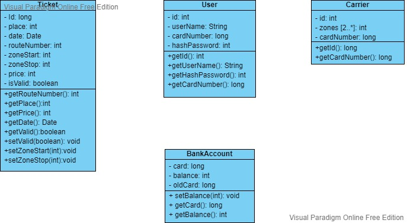
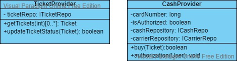

# Урок 4. Компоненты. Принципы связности и сочетаемости компонентов 

Вы принимаете участие в проекте(приложение покупки билета на автобус). Вам доступен проект разработанный вашей командой. 
Осталась только ваша часть до релиза. Вам предстоит:
1) Разработать по UML диаграмме классы домена приложения: User, Carrier, BankAccount и Ticket
2) Разработать по UML диаграмме классы: TicketProvider и CashProvider

Полностью разработанный проект должен собраться и выполниться. Общая UML диаграмма, проект и UML неразработанных 
классов приложена в материалах курса.

